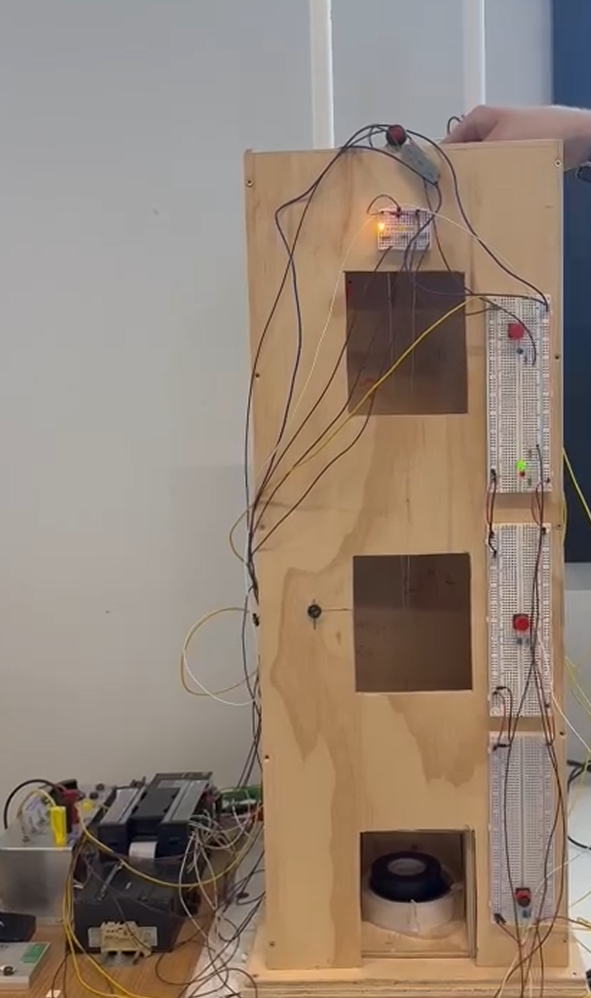

# 🧾 PLC Development Model 3 – Elevate_PLC_Control

## 🤖 Omron Single Shaft Model

This branch focuses on developing the **Physical Model logic** for the Elevate control system using **Omron** and the **CP1H** PLC.

---

## 🎯 Objectives

- ⚙️ Implement **Single Shaft 3 floor Elevator Logic**

---

## 💻 Tools & Technologies

- **Omron Programmer**

---