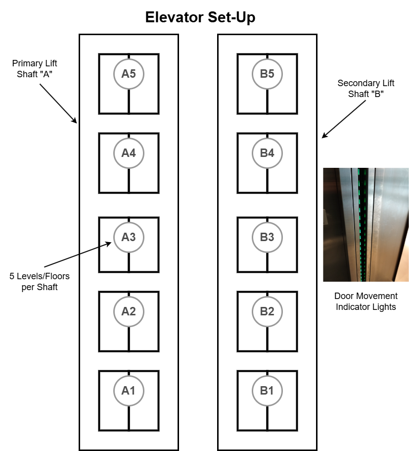

# Elevate_PLC_Control

# 🚀 Hospital Elevator Control System

## 🏗️ Project Overview
The **Hospital Elevator Control System** is a **PLC simulation-based** model designed for a hospital environment. This system incorporates **advanced elevator control logic** to handle diverse scenarios while ensuring compliance with **industry safety and regulatory standards**. 

While the primary focus is on **logic implementation and simulation**, a **hardware prototype** will also be developed using **LEDs, buttons, and an Arduino** for demonstration.

## 📌 Key Features
- **Multi-level (5 floors, 2 shafts)** system with **priority access** and **special modes**
- **Operational modes:** Normal, Floor Priority, Emergency (Fire Mode), Service Mode, Lock-out Mode
- **User Interface:** LED signals, buttons, current floor indicators, and RFID staff access
- **Accessibility Features:** Braille buttons, audio indicators for visually impaired users
- **Safety Features:** Emergency stop, door sensors, service mode key switches

## 🏗️ System Components
### **Hardware**
- **PLC**: Omron CP1H
- **Prototype Components**: Arduino, LEDs, buttons, sensors

### **Software**
- Omron CX-One
- Git
- MATLAB & Simulink
- MATLAB App Designer

## 🏆 Success & Evaluation Criteria
The project will be evaluated based on:
- ✅ **Core Requirements**: Meeting all functional specifications
- ✅ **Operational Accuracy**: Proper execution of elevator modes
- ✅ **Safety Compliance**: Adherence to hospital safety protocols
- ✅ **Usability**: Accessibility features and emergency response handling

## 📢 Team Members
**Team Name:** Elevate  
- Beau Edwards-Dart  
- Charles Kipping  
- Ethan-Josef Gito  
- James Wahbe  
- Joshua Gonzalez  
- Miriam Maher  

**Product Owner:** Quang Ha  

---